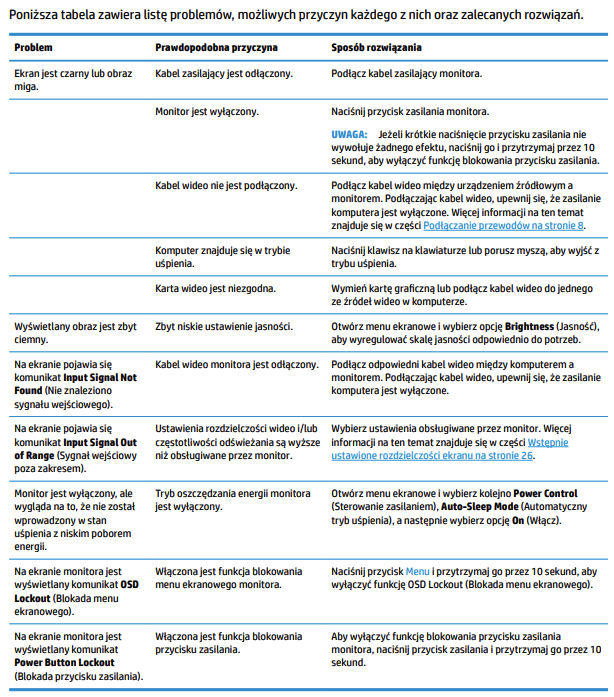

# Sztuczna Inteligencja i Inżynieria Wiedzy - Laboratoria Lista 3

# Krzysztof Otręba 266541

## Źródła

W ramach tej listy zadań stworzyłem bazę wiedzy na podstawie instrukcji do monitora HP 27F 27” 1920x1080px IPS. Instrukcja dostępna jest pod adresem https://www.mediaexpert.pl/lp,instrukcje-obslugi/hp/monitory-led/monitor-hp-27f-2xn62aa.

Zrzut ekranu z tabeli dotyczącej diagnostyki urządzenia


Pełny kod źródłowy dostępny jest na moim koncie na GitHubie https://github.com/ChrissO2/MonitorDiagnosingKnowledgeEngine.

## Implementacja

W celu implementacji powyższej tabeli stworzyłem fakt problemu z monitorem zawierający opis oraz informacje czy monitor jest podłączony, czy monitor jest włączony oraz czy jest w trybie uśpienia.

```
class Problem(Fact):
    """Fact representing a problem with a monitor"""
    description = Field(str, mandatory=True)
    is_cable_connected = Field(bool, default=True)
    is_monitor_on = Field(bool, default=True)
    is_sleep_mode_active = Field(bool, default=True)
```

Do tego dodałem fakt przedstawiający rozwiązanie problemu.

```
class Solution(Fact):
    """Fact representing a solution to a problem with a monitor"""
    step = Field(str, mandatory=True)
```

Następnie przeniosłem treść tabeli z instrukcji do silnika wiedzy

```
class MonitorDiagnosis(KnowledgeEngine):
    """Knowledge engine for diagnosing problems with a monitor"""
    @Rule(Problem(description=ProblemDescription.BLACK_SCREEN.value))
    def diagnose_black_screen_video_card(self):
        self.declare(
            Solution(step="Wymień kartę graficzną lub podłącz kabel wideo do jednego ze źródeł wideo w komputerze"))

    @Rule(Problem(
        description=ProblemDescription.BLACK_SCREEN.value,
        is_cable_connected=False))
    def diagnose_black_screen_power_cable(self):
        self.declare(
            Solution(step="Podłącz kabel zasilający monitora."))
        self.declare(Problem(description=ProblemDescription.BLACK_SCREEN.value,
                             is_monitor_on=False))

    @Rule(Problem(
        description=ProblemDescription.BLACK_SCREEN.value,
        is_monitor_on=False))
    def diagnose_black_screen_monitor_off(self):
        self.declare(
            Solution(step="Naciśnij przycisk zasilania monitora."))
        self.declare(Problem(description=ProblemDescription.BLACK_SCREEN.value,
                             is_sleep_mode_active=False))

    @Rule(Problem(
        description=ProblemDescription.BLACK_SCREEN.value,
        is_sleep_mode_active=True))
    def diagnose_black_screen_sleep_mode(self):
        self.declare(
            Solution(step="Naciśnij klawisz na klawiaturze lub porusz myszą, aby wyjść z trybu uśpienia."))

    @Rule(Problem(description=ProblemDescription.DIM_SCREEN.value))
    def diagnose_dim_screen(self):
        self.declare(Solution(
            step="Otwórz menu ekranowe i wybierz opcję Brightness (Jasność), aby wyregulować skalę jasności odpowiednio do potrzeb."))

    @Rule(Problem(description=ProblemDescription.NO_INPUT_SIGNAL.value))
    def diagnose_no_input_signal(self):
        self.declare(Solution(
            step="Podłącz odpowiedni kabel wideo między komputerem a monitorem. Upewnij się, że zasilanie komputera jest wyłączone podczas podłączania kabla wideo."))

    @Rule(Problem(description=ProblemDescription.OUT_OF_RANGE.value))
    def diagnose_out_of_range(self):
        self.declare(Solution(
            step="Wybierz ustawienia rozdzielczości i częstotliwości odświeżania obsługiwane przez monitor. Więcej informacji znajdziesz w dokumentacji monitora."))

    @Rule(Problem(description=ProblemDescription.POWER_SAVING.value))
    def diagnose_power_saving(self):
        self.declare(Solution(
            step="Otwórz menu ekranowe, wybierz Power Control (Sterowanie zasilaniem), Auto-Sleep Mode (Automatyczny tryb uśpienia) i wybierz opcję On (Włącz)."))

    @Rule(Problem(description=ProblemDescription.OSD_LOCKOUT.value))
    def diagnose_osd_lockout(self):
        self.declare(Solution(
            step="Naciśnij przycisk Menu i przytrzymaj go przez 10 sekund, aby wyłączyć funkcję OSD Lockout."))

    @Rule(Problem(description=ProblemDescription.POWER_BUTTON_LOCKOUT.value))
    def diagnose_power_button_lockout(self):
        self.declare(Solution(
            step="Naciśnij przycisk zasilania i przytrzymaj go przez 10 sekund, aby wyłączyć funkcję blokowania przycisku zasilania."))
```

## Podsumowanie

W silniku dodałem forward-chaining, chociaż nie było tego w instrukcji monitora. Jeśli Jeśli użytkownik nie podłączył monitora do zasilania zostanie zainicjowany drugi problem sugerujący włączenie monitora, a ten zainicjuje problem związany z wyłączeniem trybu uśpienia.
Program dobrze odwzorowuje instrukcję.
